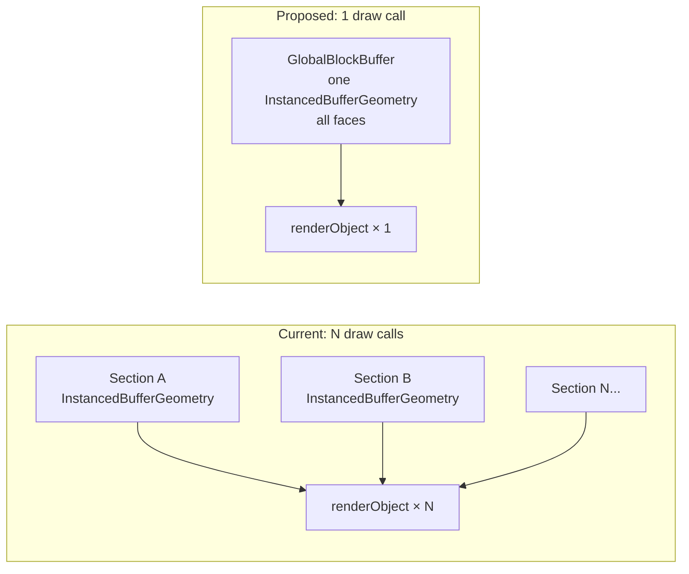

# Global Block Buffer: Zero CPU Per Frame

## Root Cause Analysis

The screenshot shows Three.js's `renderScene → renderObjects → renderObject → setup → setProgram → bindVertexArray` executing N times per frame — once per loaded section's `InstancedBufferGeometry`. This is the fundamental difference vs WebGL/WebGPU:

| | WebGL worker | WebGPU worker | Three.js (current) |
|---|---|---|---|
| Draw calls/frame | 1 | 1 (indirect) | N sections |
| VAO binds/frame | 1 | 1 | N |
| Camera move CPU | uniform upload | uniform upload | `sceneOrigin.update()` O(N) |
| Section boundary | nothing | nothing | `renderOrder` sort O(N) |

Three sources of per-frame CPU:
1. **`renderer.render()`** - Three.js traverses scene, frustum-culls, sorts N section objects, issues N draw calls
2. **`sceneOrigin.update()`** - rebases every tracked section mesh in scene space on every camera tween frame
3. **`cameraSectionPositionUpdate()`** - updates `renderOrder` on all sections when crossing a 16-block boundary

## Solution: One Global InstancedBufferGeometry

Exactly what the WebGL worker does — pack all face instances into one GPU buffer, one draw call, camera as a uniform. This can live inside Three.js as a single `Mesh` with a giant `InstancedBufferGeometry`.



## Shader Changes — [cubeBlockShader.ts](src/three/shaders/cubeBlockShader.ts)

**Add `a_w3`** (one new uint32 attribute per instance):
- bits 0–15: `sectionX` as unsigned 16-bit (value = worldSectionX + 32768, covers ±32768 sections = ±524K blocks)
- bits 16–31: `sectionZ` same encoding

**Use 5 spare bits in `a_w2`** (bits 13–17, currently unused):
- `sectionY` as 5-bit unsigned (value = worldSectionY + 4, covers sections –4 to +27, Java Edition full range)

**Replace position math** (remove `modelViewMatrix` world-section offset, add shader-side camera origin):
```glsl
// New uniform:
uniform vec3 u_cameraOrigin;  // exact world position of camera

// Decode section origin from a_w3 + a_w2 spare bits:
int sX = int(a_w3 & 0xFFFFu) - 32768;
int sZ = int(a_w3 >> 16u) - 32768;
int sY = int((a_w2 >> 13u) & 0x1Fu) - 4;
vec3 sectionOrigin = vec3(float(sX * 16), float(sY * 16), float(sZ * 16));

// World position of this face vertex, camera-relative for float32 precision:
vec3 worldPos = sectionOrigin + facePos + vec3(float(lx), float(ly), float(lz));
vec3 relativePos = worldPos - u_cameraOrigin;

// modelViewMatrix is viewMatrix when mesh is at origin (matrixWorld = identity)
vec4 mvPosition = modelViewMatrix * vec4(relativePos, 1.0);
gl_Position = projectionMatrix * mvPosition;
```

Float32 precision: at ±524K blocks, `float(sX * 16)` ≈ ±8.4M → 23-bit mantissa gives 1-block precision. Subtracting nearby `u_cameraOrigin` cancels the large part, leaving <±8192 block offsets with sub-pixel precision. Fine for rendering.

## New Class: GlobalBlockBuffer — `src/three/globalBlockBuffer.ts`

```typescript
class GlobalBlockBuffer {
  // Pre-allocated CPU-side arrays (default 4M faces)
  private w0: Uint32Array, w1: Uint32Array, w2: Uint32Array, w3: Uint32Array

  // Section → [startIndex, faceCount] slot map
  private sectionSlots = new Map<string, { start: number; count: number }>()
  private freeList: Array<{ start: number; count: number }> = []

  // The single Three.js mesh
  readonly mesh: THREE.Mesh<THREE.InstancedBufferGeometry, THREE.ShaderMaterial>

  addSection(key, sx, sy, sz, words: Uint32Array, faceCount): void
  removeSection(key): void
  uploadDirtyRange(): void  // one bufferSubData per dirty range per frame
  setCameraOrigin(x, y, z): void  // updates u_cameraOrigin uniform
}
```

Key properties:
- `THREE.InstancedBufferGeometry` with 4 `InstancedBufferAttribute`s (w0/w1/w2/w3), `usage: THREE.DynamicDrawUsage`
- `mesh.frustumCulled = false` (no per-frame AABB test needed — always draw)
- `mesh.matrixAutoUpdate = false`, `mesh.matrix.identity()`
- `geometry.instanceCount` updated only when sections are added/removed
- Separate transparent-face mesh if needed (currently shader renders opaque only)

## Changes to ChunkMeshManager — [chunkMeshManager.ts](src/three/chunkMeshManager.ts)

In `updateSection()`:
- **Remove**: `createShaderCubeMesh(shaderData, cubeMaterial)`, `sceneOrigin.track(shaderMesh)`, `shaderMesh.position.set(sx, sy, sz)`
- **Add**: `this.globalBuffer.addSection(sectionKey, sx, sy, sz, shaderData.words, shaderData.count)`

In `releaseSection()` / `cleanupSection()`:
- **Add**: `this.globalBuffer.removeSection(sectionKey)`

## Changes to WorldRendererThree — [worldRendererThree.ts](src/three/worldRendererThree.ts)

In `render()`:
- After computing `cameraPos`, call `globalBuffer.setCameraOrigin(cameraPos.x, cameraPos.y, cameraPos.z)` (O(1) uniform update)
- Remove `this.updateSectionOffsets()` sceneOrigin loop for block meshes (no longer needed for blocks)

In `cameraSectionPositionUpdate()`:
- `updatePosDataChunk` loop (renderOrder) can be removed for sections that use the global buffer (they don't need renderOrder since they're a single draw call)

## Changes to shaderCubeBridge.ts — [shaderCubeBridge.ts](src/wasm-mesher/bridge/shaderCubeBridge.ts)

- Pack `sectionY` into `a_w2` bits 13–17 at encoding time (requires knowing `sy` at the bridge call site)
- Add `a_w3` encoding: `(sectionX/16 + 32768) | ((sectionZ/16 + 32768) << 16)`
- Output `ShaderCubesOutput` gains the `w3` field

## What Stays the Same

- Section meshing (WASM workers, dirty queue) — untouched
- `sceneOrigin` for entities, signs, banners, legacy meshes — untouched
- Legacy non-shader block mesh path — untouched (rare blocks, small count)
- Third-person camera raycast (section groups still exist, still have bounding boxes)

## Expected Per-Frame Work After Change

| Work | Cost |
|---|---|
| `tween.update()` | O(1) |
| `globalBuffer.setCameraOrigin()` + `uploadDirtyRange()` | O(1) or O(dirty faces) |
| `entities.render()` | unchanged |
| `THREE.WebGLRenderer.render()` | scene with 1 block mesh + entities |
| `renderObject` for blocks | **1 call** (vs N) |
| `bindVertexArray` for blocks | **1 call** (vs N) |
| `sceneOrigin.update()` for blocks | **eliminated** |
| `renderOrder` sort for blocks | **eliminated** |

## Files Touched

- **New**: [`src/three/globalBlockBuffer.ts`](src/three/globalBlockBuffer.ts)
- [`src/three/shaders/cubeBlockShader.ts`](src/three/shaders/cubeBlockShader.ts) — add `a_w3`, sectionY in w2 spare bits, `u_cameraOrigin`
- [`src/three/chunkMeshManager.ts`](src/three/chunkMeshManager.ts) — replace `createShaderCubeMesh` with `globalBuffer.addSection`
- [`src/three/worldRendererThree.ts`](src/three/worldRendererThree.ts) — wire `setCameraOrigin`, remove per-section renderOrder loop for shader cubes
- [`src/wasm-mesher/bridge/shaderCubeBridge.ts`](src/wasm-mesher/bridge/shaderCubeBridge.ts) — encode section coords into w2/w3
- [`src/mesher-shared/shared.ts`](src/mesher-shared/shared.ts) — update `ShaderCubesOutput` type
